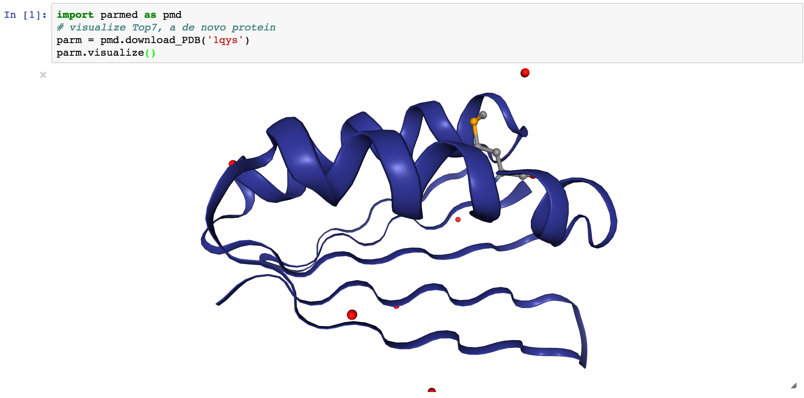
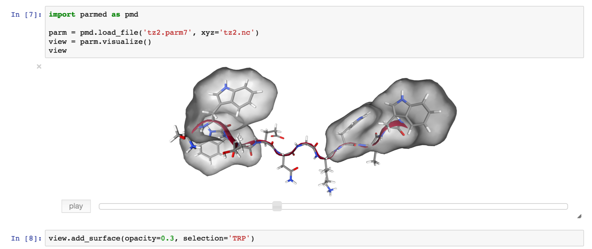

Visualization Integration
=========================

ParmEd integrates with `nglview <http://www.github.com/arose/nglview/>`_
for quick visualization in `Jupyter notebook http://jupyter.org/>`_. 

For further doc, please visit `nglview` website. Here, we only show
several examples.

- Quick 

- Visualize a trajectory

